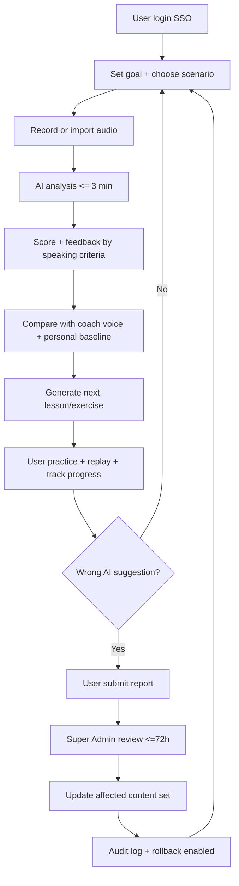

# TO-BE Process Proposal — Voice Speech Coaching

**Date:** 24/03/2026  
**Input:** AS-IS analysis + elicitation results

## 1) Quy trình TO-BE đề xuất

1. User đăng nhập (SSO) trên mobile app.
2. User chọn mục tiêu học tập và tình huống luyện nói.
3. User ghi âm hoặc import audio (theo giới hạn độ dài).
4. AI phân tích (<= 3 phút), trả điểm + nhận xét theo các yếu tố nói (trừ từ vựng).
5. Hệ thống so sánh với giọng mẫu coach và baseline cá nhân.
6. AI sinh bài học/bài tập tiếp theo, cập nhật lộ trình mỗi 2 ngày + giải thích vì sao giao bài.
7. User thực hiện bài tập, nghe lại và theo dõi % giống mẫu + tiến bộ theo thời gian.
8. Nếu AI gợi ý sai, user gửi report.
9. Super Admin xử lý report trong SLA 72h; khi cần thì cập nhật cả bộ nội dung liên quan, có audit log và rollback.

## 2) Mermaid Flow

## 3) Cách TO-BE giải quyết pain points

- Cung cấp phản hồi định lượng và định tính tức thời.
- Cá nhân hóa lộ trình theo mục tiêu và tiến độ thật.
- Tăng động lực qua tracking tiến bộ rõ ràng.
- Giảm rủi ro chất lượng AI bằng cơ chế report + review + rollback.
- Tối ưu vận hành bằng web admin và dashboard chỉ số.
