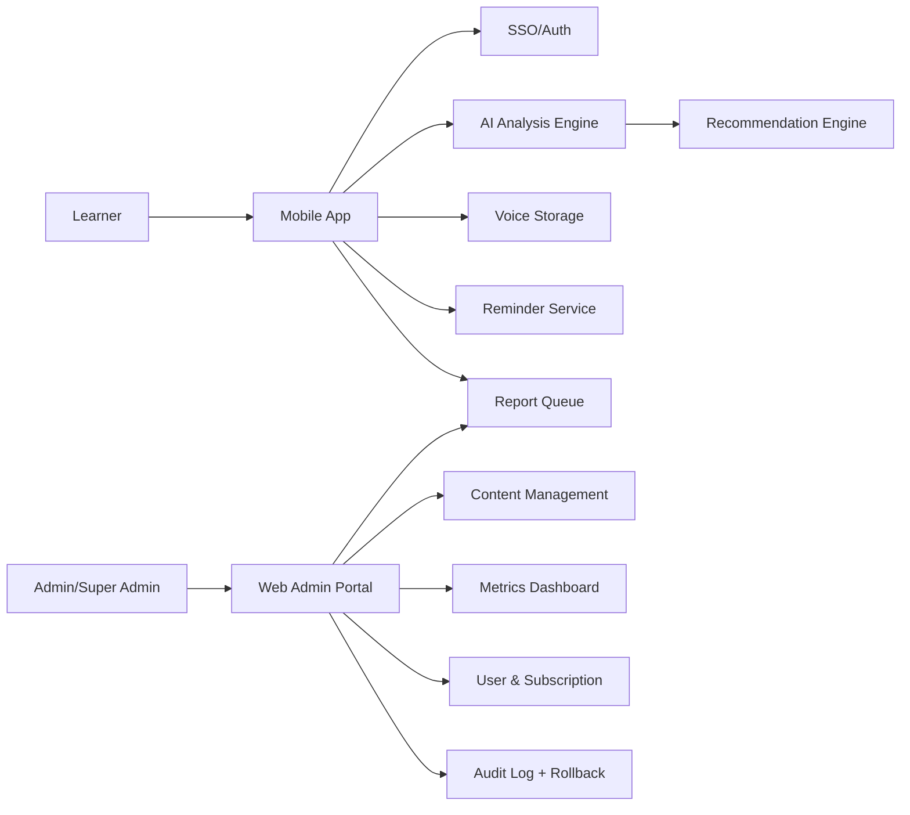

# Product Overview Model — Voice Speech Coaching

**Date:** 24/03/2026

## 1) Actors & Applications

| Thành phần | Vai trò |
|---|---|
| Student / Learner | Ghi âm, luyện tập, theo dõi tiến bộ, report lỗi AI |
| Parent (minor flow) | Đăng ký/đồng ý tài khoản cho người dùng nhỏ tuổi |
| Super Admin | Duyệt xử lý report AI, cập nhật nội dung |
| Admin / Operations | Quản trị nội dung, user, subscription, dashboard |
| Mobile App (iOS -> Android) | Trải nghiệm học tập chính cho user |
| Web Admin Portal | Quản trị nội dung, user/subscription, analytics |
| AI Analysis Engine | Phân tích giọng nói, chấm điểm, feedback |
| Learning Recommendation Engine | Sinh bài học/lộ trình theo mục tiêu |
| Voice Storage Service | Lưu trữ audio theo tài khoản, hỗ trợ xóa |
| Auth/SSO Service | Xác thực người dùng |
| Notification/Reminder Service | Nhắc lịch luyện tập |

## 2) Context Communication Model

## 3) Lưu ý sản phẩm

- Kênh user: mobile-only giai đoạn đầu (ưu tiên iOS).
- Kênh vận hành: web admin riêng.
- Dữ liệu audio lưu cloud, có quyền xóa, có thể dùng train model theo chính sách sản phẩm.
- Report AI là vòng kiểm soát chất lượng bắt buộc.
